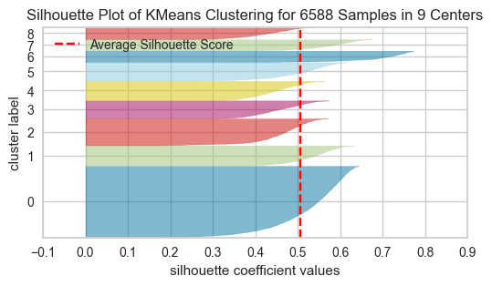

# Customer Segmentation and Churn Rate Prediction

It's a company specializing in video streaming and internet services. The dataset contains customer information, encompassing account details and churn status.

| Measure | Description |
|---------|-------------|
| viewer_id | A unique ID that identifies each customer |
| Gender | The viewer's gender: Male, Female |
| Age | The customer’s current age, in years, at the time the fiscal quarter ended (Q2 2022) |
| Married | Indicates if the customer is married: Yes, No |
| number_of_family_dependents | Indicates the number of dependents that live with the customer (dependents could be children, parents, grandparents, etc.) |
| City | The city of the customer’s primary residence in California |
| Zip Code | The zip code of the customer’s primary residence |
| Latitude | The latitude of the customer’s primary residence |
| Longitude | The longitude of the customer’s primary residence |
| Number of Referrals | Indicates the number of times the customer has referred a friend or family member to this company to date |
| Tenure in Months | Indicates the total amount of months that the customer has been with the company by the end of the quarter specified above |
| Offer | Identifies the last marketing offer that the customer accepted: None, Offer A, Offer B, Offer C, Offer D, Offer E |
| Internet Service | Indicates if the customer subscribes to Internet service with the company: Yes, No |
| Internet Type | Indicates the customer's type of internet connection: DSL, Fiber Optic, Cable (if the customer is not subscribed to internet service, this will be None) |
| Avg Monthly GB Download | Indicates the customer’s average download volume in gigabytes, calculated to the end of the quarter specified above (if the customer is not subscribed to internet service, this will be 0) |
| Online Security | Indicates if the customer subscribes to an additional online security service provided by the company: Yes, No (if the customer is not subscribed to internet service, this will be No) |
| Online Backup | Indicates if the customer subscribes to an additional online backup service provided by the company: Yes, No (if the customer is not subscribed to internet service, this will be No) |
| Device Protection Plan | Indicates if the customer subscribes to an additional device protection plan for their Internet equipment provided by the company: Yes, No (if the customer is not subscribed to internet service, this will be No) |
| Premium Tech Support | Indicates if the customer subscribes to an additional technical support plan from the company with reduced wait times: Yes, No (if the customer is not subscribed to internet service, this will be No) |
| Streaming TV | Indicates if the customer uses their Internet service to stream television programing from a third party provider at no additional fee: Yes, No (if the customer is not subscribed to internet service, this will be No) |
| Streaming Movies | Indicates if the customer uses their Internet service to stream movies from a third party provider at no additional fee: Yes, No (if the customer is not subscribed to internet service, this will be No) |
| Streaming Music | Indicates if the customer uses their Internet service to stream music from a third party provider at no additional fee: Yes, No (if the customer is not subscribed to internet service, this will be No) |
| Unlimited Hi-res Streaming | Indicates if the customer has paid an additional monthly fee to have unlimited hi-res streaming: Yes, No |
| Subscription Type | Indicates the customer’s current contract type: Month-to-Month, One Year, Two Year |
| Paperless Billing | Indicates if the customer has chosen paperless billing: Yes, No |
| Payment Method | Indicates how the customer pays their bill: Bank Withdrawal, Credit Card, Mailed Check |
| Monthly Charge | Indicates the customer’s current total monthly charge for all their services from the company |
| Total Charges | Indicates the customer’s total charges, calculated to the end of the quarter specified above |
| Total Refunds | Indicates the customer’s total refunds, calculated to the end of the quarter specified above |
| Total Extra Data Charges | Indicates the customer’s total charges for extra data downloads above those specified in their plan, by the end of the quarter specified above |
| Total Long Distance Charges | Indicates the customer’s total charges for long distance above those specified in their plan, by the end of the quarter specified above |
| Total Revenue | Indicates the company's total revenue from this customer, calculated to the end of the quarter specified above (Total Charges - Total Refunds + Total Extra Data Charges + Total Long Distance Charges) |
| Viewer Status | Indicates the status of the customer at the end of the quarter: Churned, or Stayed |


## 0. Import Packages and Load Dataset


```python
import pandas as pd
import numpy as np

# Plot
import matplotlib.pyplot as plt
import seaborn as sns

# Data Pre-processing
from sklearn.preprocessing import MinMaxScaler
from sklearn.utils import resample
from sklearn.preprocessing import OrdinalEncoder

# Prediction Model
from sklearn.ensemble import RandomForestClassifier
from sklearn.cluster import KMeans
from sklearn.tree import DecisionTreeClassifier, plot_tree
from sklearn.neighbors import KNeighborsClassifier
from sklearn.model_selection import train_test_split
from sklearn.model_selection import GridSearchCV

# Metrics
from sklearn.metrics import accuracy_score, classification_report, recall_score, precision_score
from sklearn.metrics import silhouette_score
from yellowbrick.cluster import SilhouetteVisualizer
```


```python
# Load Dataset
df = pd.read_csv("telecom_customer_churn.csv")
df.head()
```


<div>
<style scoped>
    .dataframe tbody tr th:only-of-type {
        vertical-align: middle;
    }

    .dataframe tbody tr th {
        vertical-align: top;
    }

    .dataframe thead th {
        text-align: right;
    }
</style>
<table border="1" class="dataframe">
  <thead>
    <tr style="text-align: right;">
      <th></th>
      <th>viewer_id</th>
      <th>gender</th>
      <th>age</th>
      <th>married</th>
      <th>number_of_family_dependents</th>
      <th>city</th>
      <th>zip_code</th>
      <th>latitude</th>
      <th>longitude</th>
      <th>number_of_referrals</th>
      <th>...</th>
      <th>subscription_type</th>
      <th>paperless_billing</th>
      <th>payment_method</th>
      <th>monthly_charge</th>
      <th>total_charges</th>
      <th>total_refunds</th>
      <th>total_extra_data_charges</th>
      <th>total_long_distance_charges</th>
      <th>total_revenue</th>
      <th>viewer_status</th>
    </tr>
  </thead>
  <tbody>
    <tr>
      <th>0</th>
      <td>0002-ORFBO</td>
      <td>Female</td>
      <td>37</td>
      <td>Yes</td>
      <td>0</td>
      <td>SD</td>
      <td>93225</td>
      <td>34.827662</td>
      <td>-118.999073</td>
      <td>2</td>
      <td>...</td>
      <td>One Year</td>
      <td>Yes</td>
      <td>Credit Card</td>
      <td>65.6</td>
      <td>593.30</td>
      <td>0.00</td>
      <td>0</td>
      <td>381.51</td>
      <td>974.81</td>
      <td>Stayed</td>
    </tr>
    <tr>
      <th>1</th>
      <td>0003-MKNFE</td>
      <td>Male</td>
      <td>46</td>
      <td>No</td>
      <td>0</td>
      <td>SD</td>
      <td>91206</td>
      <td>34.162515</td>
      <td>-118.203869</td>
      <td>0</td>
      <td>...</td>
      <td>Month-to-Month</td>
      <td>No</td>
      <td>Credit Card</td>
      <td>-4.0</td>
      <td>542.40</td>
      <td>38.33</td>
      <td>10</td>
      <td>96.21</td>
      <td>610.28</td>
      <td>Stayed</td>
    </tr>
    <tr>
      <th>2</th>
      <td>0004-TLHLJ</td>
      <td>Male</td>
      <td>50</td>
      <td>No</td>
      <td>0</td>
      <td>SD</td>
      <td>92627</td>
      <td>33.645672</td>
      <td>-117.922613</td>
      <td>0</td>
      <td>...</td>
      <td>Month-to-Month</td>
      <td>Yes</td>
      <td>Bank Withdrawal</td>
      <td>73.9</td>
      <td>280.85</td>
      <td>0.00</td>
      <td>0</td>
      <td>134.60</td>
      <td>415.45</td>
      <td>Churned</td>
    </tr>
    <tr>
      <th>3</th>
      <td>0011-IGKFF</td>
      <td>Male</td>
      <td>78</td>
      <td>Yes</td>
      <td>0</td>
      <td>SD</td>
      <td>94553</td>
      <td>38.014457</td>
      <td>-122.115432</td>
      <td>1</td>
      <td>...</td>
      <td>Month-to-Month</td>
      <td>Yes</td>
      <td>Bank Withdrawal</td>
      <td>98.0</td>
      <td>1237.85</td>
      <td>0.00</td>
      <td>0</td>
      <td>361.66</td>
      <td>1599.51</td>
      <td>Churned</td>
    </tr>
    <tr>
      <th>4</th>
      <td>0013-EXCHZ</td>
      <td>Female</td>
      <td>75</td>
      <td>Yes</td>
      <td>0</td>
      <td>SD</td>
      <td>93010</td>
      <td>34.227846</td>
      <td>-119.079903</td>
      <td>3</td>
      <td>...</td>
      <td>Month-to-Month</td>
      <td>Yes</td>
      <td>Credit Card</td>
      <td>83.9</td>
      <td>267.40</td>
      <td>0.00</td>
      <td>0</td>
      <td>22.14</td>
      <td>289.54</td>
      <td>Churned</td>
    </tr>
  </tbody>
</table>
<p>5 rows × 33 columns</p>
</div>


## 1. Data Preprocessing & Exploratory Data Analytics

#### 1.1 Shape


```python
# Check number of rows and columns in the dataset
df.shape
```


    (6588, 33)


#### 1.2 Data type


```python
# Check data type and convert data type if needed
df.dtypes
```


    viewer_id                       object
    gender                          object
    age                              int64
    married                         object
    number_of_family_dependents      int64
    city                            object
    zip_code                         int64
    latitude                       float64
    longitude                      float64
    number_of_referrals              int64
    tenure_in_months                 int64
    offer                           object
    internet_service                object
    internet_type                   object
    avg_monthly_gb_download        float64
    online_security                 object
    online_backup                   object
    device_protection_plan          object
    premium_tech_support            object
    streaming_tv                    object
    streaming_movies                object
    streaming_music                 object
    unlimited_hi-res_streaming      object
    subscription_type               object
    paperless_billing               object
    payment_method                  object
    monthly_charge                 float64
    total_charges                  float64
    total_refunds                  float64
    total_extra_data_charges         int64
    total_long_distance_charges    float64
    total_revenue                  float64
    viewer_status                   object
    dtype: object


```python
# Convert zip code from int to string
df['zip_code'] = str(df['zip_code'])

# Convert below column to categorical data
categorical_columns = [
    'gender', 'married', 'city', 'offer', 'internet_service', 'internet_type',
    'online_security', 'online_backup', 'device_protection_plan',
    'premium_tech_support', 'streaming_tv', 'streaming_movies', 'streaming_music',
    'unlimited_hi-res_streaming', 'subscription_type', 'paperless_billing', 'payment_method'
]

# Fill NA value
df[categorical_columns] = df[categorical_columns].fillna('Unknown')
```

#### 1.3 Missing values


```python
# Check if there is null value in the dataset and handle missing value properly
df.isna().sum()
```


    viewer_id                         0
    gender                            0
    age                               0
    married                           0
    number_of_family_dependents       0
    city                              0
    zip_code                          0
    latitude                          0
    longitude                         0
    number_of_referrals               0
    tenure_in_months                  0
    offer                             0
    internet_service                  0
    internet_type                     0
    avg_monthly_gb_download        1344
    online_security                   0
    online_backup                     0
    device_protection_plan            0
    premium_tech_support              0
    streaming_tv                      0
    streaming_movies                  0
    streaming_music                   0
    unlimited_hi-res_streaming        0
    subscription_type                 0
    paperless_billing                 0
    payment_method                    0
    monthly_charge                    0
    total_charges                     0
    total_refunds                     0
    total_extra_data_charges          0
    total_long_distance_charges       0
    total_revenue                     0
    viewer_status                     0
    dtype: int64


```python
# Replace NAs with 0 in column "Avg Monthly GB Download" 
df['avg_monthly_gb_download'] = df['avg_monthly_gb_download'].fillna(0)
```


```python
df.dtypes
```


    viewer_id                       object
    gender                          object
    age                              int64
    married                         object
    number_of_family_dependents      int64
    city                            object
    zip_code                        object
    latitude                       float64
    longitude                      float64
    number_of_referrals              int64
    tenure_in_months                 int64
    offer                           object
    internet_service                object
    internet_type                   object
    avg_monthly_gb_download        float64
    online_security                 object
    online_backup                   object
    device_protection_plan          object
    premium_tech_support            object
    streaming_tv                    object
    streaming_movies                object
    streaming_music                 object
    unlimited_hi-res_streaming      object
    subscription_type               object
    paperless_billing               object
    payment_method                  object
    monthly_charge                 float64
    total_charges                  float64
    total_refunds                  float64
    total_extra_data_charges         int64
    total_long_distance_charges    float64
    total_revenue                  float64
    viewer_status                   object
    dtype: object


```python
df.isna().sum()
```


    viewer_id                      0
    gender                         0
    age                            0
    married                        0
    number_of_family_dependents    0
    city                           0
    zip_code                       0
    latitude                       0
    longitude                      0
    number_of_referrals            0
    tenure_in_months               0
    offer                          0
    internet_service               0
    internet_type                  0
    avg_monthly_gb_download        0
    online_security                0
    online_backup                  0
    device_protection_plan         0
    premium_tech_support           0
    streaming_tv                   0
    streaming_movies               0
    streaming_music                0
    unlimited_hi-res_streaming     0
    subscription_type              0
    paperless_billing              0
    payment_method                 0
    monthly_charge                 0
    total_charges                  0
    total_refunds                  0
    total_extra_data_charges       0
    total_long_distance_charges    0
    total_revenue                  0
    viewer_status                  0
    dtype: int64


#### 1.4 Group Age
Grouping by age. I'm not sure if we need this or not; I'm just grouping it for the possibility of future analysis.


```python
# Group age for analysis
bin_edges = [0, 10, 20, 30, 40, 50, 60, 70, 80, 90, 100]
bin_labels = ['0-10', '11-20', '21-30', '31-40', '41-50', '51-60', '61-70', '71-80', '81-90', '91-100']

df['age_group'] = pd.cut(df['age'], bins=bin_edges, labels=bin_labels, right=False)
print(df[['age', 'age_group']])
```

          age age_group
    0      37     31-40
    1      46     41-50
    2      50     51-60
    3      78     71-80
    4      75     71-80
    ...   ...       ...
    6583   36     31-40
    6584   20     21-30
    6585   40     41-50
    6586   21     21-30
    6587   36     31-40
    
    [6588 rows x 2 columns]


#### 1.5 Outlier
Check outlier for numerical data


```python
df.describe()
```


<div>
<style scoped>
    .dataframe tbody tr th:only-of-type {
        vertical-align: middle;
    }

    .dataframe tbody tr th {
        vertical-align: top;
    }

    .dataframe thead th {
        text-align: right;
    }
</style>
<table border="1" class="dataframe">
  <thead>
    <tr style="text-align: right;">
      <th></th>
      <th>age</th>
      <th>number_of_family_dependents</th>
      <th>latitude</th>
      <th>longitude</th>
      <th>number_of_referrals</th>
      <th>tenure_in_months</th>
      <th>avg_monthly_gb_download</th>
      <th>monthly_charge</th>
      <th>total_charges</th>
      <th>total_refunds</th>
      <th>total_extra_data_charges</th>
      <th>total_long_distance_charges</th>
      <th>total_revenue</th>
    </tr>
  </thead>
  <tbody>
    <tr>
      <th>count</th>
      <td>6588.000000</td>
      <td>6588.000000</td>
      <td>6588.000000</td>
      <td>6588.000000</td>
      <td>6588.000000</td>
      <td>6588.000000</td>
      <td>6588.000000</td>
      <td>6588.000000</td>
      <td>6588.000000</td>
      <td>6588.000000</td>
      <td>6588.000000</td>
      <td>6588.000000</td>
      <td>6588.000000</td>
    </tr>
    <tr>
      <th>mean</th>
      <td>46.757438</td>
      <td>0.476169</td>
      <td>36.199980</td>
      <td>-119.757549</td>
      <td>2.021099</td>
      <td>34.494232</td>
      <td>20.877505</td>
      <td>65.023915</td>
      <td>2431.211611</td>
      <td>2.081254</td>
      <td>7.170613</td>
      <td>798.101053</td>
      <td>3234.402023</td>
    </tr>
    <tr>
      <th>std</th>
      <td>16.840793</td>
      <td>0.968555</td>
      <td>2.472582</td>
      <td>2.155838</td>
      <td>3.024220</td>
      <td>23.966333</td>
      <td>20.407620</td>
      <td>31.098217</td>
      <td>2264.668413</td>
      <td>8.125630</td>
      <td>25.804970</td>
      <td>853.832041</td>
      <td>2854.047975</td>
    </tr>
    <tr>
      <th>min</th>
      <td>19.000000</td>
      <td>0.000000</td>
      <td>32.555828</td>
      <td>-124.301372</td>
      <td>0.000000</td>
      <td>1.000000</td>
      <td>0.000000</td>
      <td>-10.000000</td>
      <td>18.850000</td>
      <td>0.000000</td>
      <td>0.000000</td>
      <td>0.000000</td>
      <td>21.610000</td>
    </tr>
    <tr>
      <th>25%</th>
      <td>33.000000</td>
      <td>0.000000</td>
      <td>33.989286</td>
      <td>-121.790034</td>
      <td>0.000000</td>
      <td>12.000000</td>
      <td>4.000000</td>
      <td>35.800000</td>
      <td>544.362500</td>
      <td>0.000000</td>
      <td>0.000000</td>
      <td>106.665000</td>
      <td>835.407500</td>
    </tr>
    <tr>
      <th>50%</th>
      <td>46.000000</td>
      <td>0.000000</td>
      <td>36.245926</td>
      <td>-119.601370</td>
      <td>0.000000</td>
      <td>32.000000</td>
      <td>17.000000</td>
      <td>71.025000</td>
      <td>1562.700000</td>
      <td>0.000000</td>
      <td>0.000000</td>
      <td>472.240000</td>
      <td>2375.925000</td>
    </tr>
    <tr>
      <th>75%</th>
      <td>60.000000</td>
      <td>0.000000</td>
      <td>38.169605</td>
      <td>-117.967399</td>
      <td>3.000000</td>
      <td>57.000000</td>
      <td>27.000000</td>
      <td>90.400000</td>
      <td>3998.350000</td>
      <td>0.000000</td>
      <td>0.000000</td>
      <td>1275.872500</td>
      <td>5105.207500</td>
    </tr>
    <tr>
      <th>max</th>
      <td>80.000000</td>
      <td>9.000000</td>
      <td>41.962127</td>
      <td>-114.192901</td>
      <td>11.000000</td>
      <td>72.000000</td>
      <td>85.000000</td>
      <td>118.750000</td>
      <td>8684.800000</td>
      <td>49.790000</td>
      <td>150.000000</td>
      <td>3564.720000</td>
      <td>11979.340000</td>
    </tr>
  </tbody>
</table>
</div>


```python
# Plot barplot for these columns
columns_to_plot = ['age', 'number_of_family_dependents', 'number_of_referrals', 'tenure_in_months', 
                    'avg_monthly_gb_download', 'monthly_charge', 'total_charges', 'total_refunds', 
                    'total_extra_data_charges', 'total_long_distance_charges', 'total_revenue']


fig, axs = plt.subplots(nrows=3, ncols=4, figsize=(15, 6))
axs = axs.flatten()

for i, column in enumerate(columns_to_plot):
    sns.boxplot(x=df[column], ax=axs[i], color='skyblue')
    axs[i].set_title(column)

plt.tight_layout()
plt.show()

```

    /Users/tsaiweiyi/venv3/lib/python3.9/site-packages/seaborn/_oldcore.py:1498: FutureWarning: is_categorical_dtype is deprecated and will be removed in a future version. Use isinstance(dtype, CategoricalDtype) instead
      if pd.api.types.is_categorical_dtype(vector):
    /Users/tsaiweiyi/venv3/lib/python3.9/site-packages/seaborn/_oldcore.py:1498: FutureWarning: is_categorical_dtype is deprecated and will be removed in a future version. Use isinstance(dtype, CategoricalDtype) instead
      if pd.api.types.is_categorical_dtype(vector):
    /Users/tsaiweiyi/venv3/lib/python3.9/site-packages/seaborn/_oldcore.py:1498: FutureWarning: is_categorical_dtype is deprecated and will be removed in a future version. Use isinstance(dtype, CategoricalDtype) instead
      if pd.api.types.is_categorical_dtype(vector):
    /Users/tsaiweiyi/venv3/lib/python3.9/site-packages/seaborn/_oldcore.py:1498: FutureWarning: is_categorical_dtype is deprecated and will be removed in a future version. Use isinstance(dtype, CategoricalDtype) instead
      if pd.api.types.is_categorical_dtype(vector):
    /Users/tsaiweiyi/venv3/lib/python3.9/site-packages/seaborn/_oldcore.py:1498: FutureWarning: is_categorical_dtype is deprecated and will be removed in a future version. Use isinstance(dtype, CategoricalDtype) instead
      if pd.api.types.is_categorical_dtype(vector):
    /Users/tsaiweiyi/venv3/lib/python3.9/site-packages/seaborn/_oldcore.py:1498: FutureWarning: is_categorical_dtype is deprecated and will be removed in a future version. Use isinstance(dtype, CategoricalDtype) instead
      if pd.api.types.is_categorical_dtype(vector):
    /Users/tsaiweiyi/venv3/lib/python3.9/site-packages/seaborn/_oldcore.py:1498: FutureWarning: is_categorical_dtype is deprecated and will be removed in a future version. Use isinstance(dtype, CategoricalDtype) instead
      if pd.api.types.is_categorical_dtype(vector):
    /Users/tsaiweiyi/venv3/lib/python3.9/site-packages/seaborn/_oldcore.py:1498: FutureWarning: is_categorical_dtype is deprecated and will be removed in a future version. Use isinstance(dtype, CategoricalDtype) instead
      if pd.api.types.is_categorical_dtype(vector):
    /Users/tsaiweiyi/venv3/lib/python3.9/site-packages/seaborn/_oldcore.py:1498: FutureWarning: is_categorical_dtype is deprecated and will be removed in a future version. Use isinstance(dtype, CategoricalDtype) instead
      if pd.api.types.is_categorical_dtype(vector):
    /Users/tsaiweiyi/venv3/lib/python3.9/site-packages/seaborn/_oldcore.py:1498: FutureWarning: is_categorical_dtype is deprecated and will be removed in a future version. Use isinstance(dtype, CategoricalDtype) instead
      if pd.api.types.is_categorical_dtype(vector):
    /Users/tsaiweiyi/venv3/lib/python3.9/site-packages/seaborn/_oldcore.py:1498: FutureWarning: is_categorical_dtype is deprecated and will be removed in a future version. Use isinstance(dtype, CategoricalDtype) instead
      if pd.api.types.is_categorical_dtype(vector):


    

    


There is outlier in column "number_of_family_dependents", "number_of_referrals", "avg_monthly_dg_download", "total_refunds", "total_extra_data_charges", "total_long_distance_charges", and "total_revenue". However, sometimes outlier can provide information to the model. I want to check how many data point is outlier in each feature.


```python
print("number_of_family_dependents:", (df['number_of_family_dependents'] > 0).sum())
print("number_of_referrals:", (df['number_of_referrals'] > 7.5).sum())
print("avg_monthly_gb_download:", (df['avg_monthly_gb_download'] > 60).sum())
print("total_refunds:", (df['total_refunds'] > 0).sum())
print("total_extra_data_charges:", (df['total_extra_data_charges'] > 0).sum())

# handle column total_long_distance_charges, as it is hard to know the upper bound by eyes
q1, q3 = np.percentile(df['total_long_distance_charges'], [25, 75])
upper = q3 + (q3-q1) * 1.5
print("total_long_distance_charges:", (df['total_long_distance_charges'] > upper).sum())

# handle column total_long_distance_charges, as it is hard to know the upper bound by eyes
q1, q3 = np.percentile(df['total_revenue'], [25, 75])
upper = q3 + (q3-q1) * 1.5
print("total_revenue:", (df['total_revenue'] > upper).sum())
```

    number_of_family_dependents: 1547
    number_of_referrals: 649
    avg_monthly_gb_download: 342
    total_refunds: 520
    total_extra_data_charges: 684
    total_long_distance_charges: 136
    total_revenue: 9


Looks like some of the featuere has way too many outlier. After looking at the raw data, the value all looks normal, I believe it make sense in this situation. For instance, consider the number of family dependents: most customers have zero family dependents, and very few have 1 to 9 dependents. This pattern still makes sense and maybe the data points with familiy dependents can provide valuable insight for our model. Therefore, I will keep it unchanged. Treat other feature the same, I don't want to remove outliers as I believe they could provide valuable insights.

#### 1.6 Invalid value


```python
# Check if there have number or amount of money less than 0
columns = ['number_of_family_dependents', 'number_of_referrals', 'tenure_in_months', 
           'avg_monthly_gb_download', 'monthly_charge', 'total_charges', 'total_refunds', 
           'total_extra_data_charges', 'total_long_distance_charges', 'total_revenue']

for c in columns:
    less_than_zero = df[df[c] < 0]
    if not less_than_zero.empty:
        print(f"There are values less than 0 in column '{c}'")
        print(f"Number of rows where '{c}' < 0: {len(less_than_zero)}")
    else:
        print(f"No values less than 0 in column '{c}'")
```

    No values less than 0 in column 'number_of_family_dependents'
    No values less than 0 in column 'number_of_referrals'
    No values less than 0 in column 'tenure_in_months'
    No values less than 0 in column 'avg_monthly_gb_download'
    There are values less than 0 in column 'monthly_charge'
    Number of rows where 'monthly_charge' < 0: 114
    No values less than 0 in column 'total_charges'
    No values less than 0 in column 'total_refunds'
    No values less than 0 in column 'total_extra_data_charges'
    No values less than 0 in column 'total_long_distance_charges'
    No values less than 0 in column 'total_revenue'


```python
# monthly charge has value less than 0
# Calculate the mean of 'monthly_charge' column
mean_monthly_charge = df['monthly_charge'].mean()

# Replace negative values with the mean
df['monthly_charge'] = df['monthly_charge'].apply(lambda x: mean_monthly_charge if x < 0 else x)
```


```python
# Check if there is weird value or imbalance target variable
categorical_variables = ['gender', 'city', 'offer', 'internet_service', 'internet_type', 'online_security', 
                          'online_backup', 'device_protection_plan', 'premium_tech_support', 'streaming_tv',
                          'streaming_movies', 'streaming_music', 'unlimited_hi-res_streaming', 'subscription_type',
                          'paperless_billing', 'payment_method', 'viewer_status']


fig, axs = plt.subplots(nrows=4, ncols=5, figsize=(15, 10))
axs = axs.flatten()


for i, variable in enumerate(categorical_variables):
    sns.countplot(data=df, x=variable, ax=axs[i], palette='pastel')
    axs[i].set_title(variable)
    axs[i].set_xticklabels(axs[i].get_xticklabels(), rotation=45, ha='right')


plt.tight_layout()
plt.show()

```

    /Users/tsaiweiyi/venv3/lib/python3.9/site-packages/seaborn/_oldcore.py:1498: FutureWarning: is_categorical_dtype is deprecated and will be removed in a future version. Use isinstance(dtype, CategoricalDtype) instead
      if pd.api.types.is_categorical_dtype(vector):
    /Users/tsaiweiyi/venv3/lib/python3.9/site-packages/seaborn/_oldcore.py:1498: FutureWarning: is_categorical_dtype is deprecated and will be removed in a future version. Use isinstance(dtype, CategoricalDtype) instead
      if pd.api.types.is_categorical_dtype(vector):
    /Users/tsaiweiyi/venv3/lib/python3.9/site-packages/seaborn/_oldcore.py:1498: FutureWarning: is_categorical_dtype is deprecated and will be removed in a future version. Use isinstance(dtype, CategoricalDtype) instead
      if pd.api.types.is_categorical_dtype(vector):
    /Users/tsaiweiyi/venv3/lib/python3.9/site-packages/seaborn/_oldcore.py:1498: FutureWarning: is_categorical_dtype is deprecated and will be removed in a future version. Use isinstance(dtype, CategoricalDtype) instead
      if pd.api.types.is_categorical_dtype(vector):
    /Users/tsaiweiyi/venv3/lib/python3.9/site-packages/seaborn/_oldcore.py:1498: FutureWarning: is_categorical_dtype is deprecated and will be removed in a future version. Use isinstance(dtype, CategoricalDtype) instead
      if pd.api.types.is_categorical_dtype(vector):
    /Users/tsaiweiyi/venv3/lib/python3.9/site-packages/seaborn/_oldcore.py:1498: FutureWarning: is_categorical_dtype is deprecated and will be removed in a future version. Use isinstance(dtype, CategoricalDtype) instead
      if pd.api.types.is_categorical_dtype(vector):
    /Users/tsaiweiyi/venv3/lib/python3.9/site-packages/seaborn/_oldcore.py:1498: FutureWarning: is_categorical_dtype is deprecated and will be removed in a future version. Use isinstance(dtype, CategoricalDtype) instead
      if pd.api.types.is_categorical_dtype(vector):
    /Users/tsaiweiyi/venv3/lib/python3.9/site-packages/seaborn/_oldcore.py:1498: FutureWarning: is_categorical_dtype is deprecated and will be removed in a future version. Use isinstance(dtype, CategoricalDtype) instead
      if pd.api.types.is_categorical_dtype(vector):
    /Users/tsaiweiyi/venv3/lib/python3.9/site-packages/seaborn/_oldcore.py:1498: FutureWarning: is_categorical_dtype is deprecated and will be removed in a future version. Use isinstance(dtype, CategoricalDtype) instead
      if pd.api.types.is_categorical_dtype(vector):
    /Users/tsaiweiyi/venv3/lib/python3.9/site-packages/seaborn/_oldcore.py:1498: FutureWarning: is_categorical_dtype is deprecated and will be removed in a future version. Use isinstance(dtype, CategoricalDtype) instead
      if pd.api.types.is_categorical_dtype(vector):
    /Users/tsaiweiyi/venv3/lib/python3.9/site-packages/seaborn/_oldcore.py:1498: FutureWarning: is_categorical_dtype is deprecated and will be removed in a future version. Use isinstance(dtype, CategoricalDtype) instead
      if pd.api.types.is_categorical_dtype(vector):
    /Users/tsaiweiyi/venv3/lib/python3.9/site-packages/seaborn/_oldcore.py:1498: FutureWarning: is_categorical_dtype is deprecated and will be removed in a future version. Use isinstance(dtype, CategoricalDtype) instead
      if pd.api.types.is_categorical_dtype(vector):
    /Users/tsaiweiyi/venv3/lib/python3.9/site-packages/seaborn/_oldcore.py:1498: FutureWarning: is_categorical_dtype is deprecated and will be removed in a future version. Use isinstance(dtype, CategoricalDtype) instead
      if pd.api.types.is_categorical_dtype(vector):
    /Users/tsaiweiyi/venv3/lib/python3.9/site-packages/seaborn/_oldcore.py:1498: FutureWarning: is_categorical_dtype is deprecated and will be removed in a future version. Use isinstance(dtype, CategoricalDtype) instead
      if pd.api.types.is_categorical_dtype(vector):
    /Users/tsaiweiyi/venv3/lib/python3.9/site-packages/seaborn/_oldcore.py:1498: FutureWarning: is_categorical_dtype is deprecated and will be removed in a future version. Use isinstance(dtype, CategoricalDtype) instead
      if pd.api.types.is_categorical_dtype(vector):
    /Users/tsaiweiyi/venv3/lib/python3.9/site-packages/seaborn/_oldcore.py:1498: FutureWarning: is_categorical_dtype is deprecated and will be removed in a future version. Use isinstance(dtype, CategoricalDtype) instead
      if pd.api.types.is_categorical_dtype(vector):
    /Users/tsaiweiyi/venv3/lib/python3.9/site-packages/seaborn/_oldcore.py:1498: FutureWarning: is_categorical_dtype is deprecated and will be removed in a future version. Use isinstance(dtype, CategoricalDtype) instead
      if pd.api.types.is_categorical_dtype(vector):
    /Users/tsaiweiyi/venv3/lib/python3.9/site-packages/seaborn/_oldcore.py:1498: FutureWarning: is_categorical_dtype is deprecated and will be removed in a future version. Use isinstance(dtype, CategoricalDtype) instead
      if pd.api.types.is_categorical_dtype(vector):
    /Users/tsaiweiyi/venv3/lib/python3.9/site-packages/seaborn/_oldcore.py:1498: FutureWarning: is_categorical_dtype is deprecated and will be removed in a future version. Use isinstance(dtype, CategoricalDtype) instead
      if pd.api.types.is_categorical_dtype(vector):
    /Users/tsaiweiyi/venv3/lib/python3.9/site-packages/seaborn/_oldcore.py:1498: FutureWarning: is_categorical_dtype is deprecated and will be removed in a future version. Use isinstance(dtype, CategoricalDtype) instead
      if pd.api.types.is_categorical_dtype(vector):
    /Users/tsaiweiyi/venv3/lib/python3.9/site-packages/seaborn/_oldcore.py:1498: FutureWarning: is_categorical_dtype is deprecated and will be removed in a future version. Use isinstance(dtype, CategoricalDtype) instead
      if pd.api.types.is_categorical_dtype(vector):
    /Users/tsaiweiyi/venv3/lib/python3.9/site-packages/seaborn/_oldcore.py:1498: FutureWarning: is_categorical_dtype is deprecated and will be removed in a future version. Use isinstance(dtype, CategoricalDtype) instead
      if pd.api.types.is_categorical_dtype(vector):
    /Users/tsaiweiyi/venv3/lib/python3.9/site-packages/seaborn/_oldcore.py:1498: FutureWarning: is_categorical_dtype is deprecated and will be removed in a future version. Use isinstance(dtype, CategoricalDtype) instead
      if pd.api.types.is_categorical_dtype(vector):
    /Users/tsaiweiyi/venv3/lib/python3.9/site-packages/seaborn/_oldcore.py:1498: FutureWarning: is_categorical_dtype is deprecated and will be removed in a future version. Use isinstance(dtype, CategoricalDtype) instead
      if pd.api.types.is_categorical_dtype(vector):
    /Users/tsaiweiyi/venv3/lib/python3.9/site-packages/seaborn/_oldcore.py:1498: FutureWarning: is_categorical_dtype is deprecated and will be removed in a future version. Use isinstance(dtype, CategoricalDtype) instead
      if pd.api.types.is_categorical_dtype(vector):
    /Users/tsaiweiyi/venv3/lib/python3.9/site-packages/seaborn/_oldcore.py:1498: FutureWarning: is_categorical_dtype is deprecated and will be removed in a future version. Use isinstance(dtype, CategoricalDtype) instead
      if pd.api.types.is_categorical_dtype(vector):
    /Users/tsaiweiyi/venv3/lib/python3.9/site-packages/seaborn/_oldcore.py:1498: FutureWarning: is_categorical_dtype is deprecated and will be removed in a future version. Use isinstance(dtype, CategoricalDtype) instead
      if pd.api.types.is_categorical_dtype(vector):
    /Users/tsaiweiyi/venv3/lib/python3.9/site-packages/seaborn/_oldcore.py:1498: FutureWarning: is_categorical_dtype is deprecated and will be removed in a future version. Use isinstance(dtype, CategoricalDtype) instead
      if pd.api.types.is_categorical_dtype(vector):
    /Users/tsaiweiyi/venv3/lib/python3.9/site-packages/seaborn/_oldcore.py:1498: FutureWarning: is_categorical_dtype is deprecated and will be removed in a future version. Use isinstance(dtype, CategoricalDtype) instead
      if pd.api.types.is_categorical_dtype(vector):
    /Users/tsaiweiyi/venv3/lib/python3.9/site-packages/seaborn/_oldcore.py:1498: FutureWarning: is_categorical_dtype is deprecated and will be removed in a future version. Use isinstance(dtype, CategoricalDtype) instead
      if pd.api.types.is_categorical_dtype(vector):
    /Users/tsaiweiyi/venv3/lib/python3.9/site-packages/seaborn/_oldcore.py:1498: FutureWarning: is_categorical_dtype is deprecated and will be removed in a future version. Use isinstance(dtype, CategoricalDtype) instead
      if pd.api.types.is_categorical_dtype(vector):
    /Users/tsaiweiyi/venv3/lib/python3.9/site-packages/seaborn/_oldcore.py:1498: FutureWarning: is_categorical_dtype is deprecated and will be removed in a future version. Use isinstance(dtype, CategoricalDtype) instead
      if pd.api.types.is_categorical_dtype(vector):
    /Users/tsaiweiyi/venv3/lib/python3.9/site-packages/seaborn/_oldcore.py:1498: FutureWarning: is_categorical_dtype is deprecated and will be removed in a future version. Use isinstance(dtype, CategoricalDtype) instead
      if pd.api.types.is_categorical_dtype(vector):
    /Users/tsaiweiyi/venv3/lib/python3.9/site-packages/seaborn/_oldcore.py:1498: FutureWarning: is_categorical_dtype is deprecated and will be removed in a future version. Use isinstance(dtype, CategoricalDtype) instead
      if pd.api.types.is_categorical_dtype(vector):
    /Users/tsaiweiyi/venv3/lib/python3.9/site-packages/seaborn/_oldcore.py:1498: FutureWarning: is_categorical_dtype is deprecated and will be removed in a future version. Use isinstance(dtype, CategoricalDtype) instead
      if pd.api.types.is_categorical_dtype(vector):
    /Users/tsaiweiyi/venv3/lib/python3.9/site-packages/seaborn/_oldcore.py:1498: FutureWarning: is_categorical_dtype is deprecated and will be removed in a future version. Use isinstance(dtype, CategoricalDtype) instead
      if pd.api.types.is_categorical_dtype(vector):
    /Users/tsaiweiyi/venv3/lib/python3.9/site-packages/seaborn/_oldcore.py:1498: FutureWarning: is_categorical_dtype is deprecated and will be removed in a future version. Use isinstance(dtype, CategoricalDtype) instead
      if pd.api.types.is_categorical_dtype(vector):
    /Users/tsaiweiyi/venv3/lib/python3.9/site-packages/seaborn/_oldcore.py:1498: FutureWarning: is_categorical_dtype is deprecated and will be removed in a future version. Use isinstance(dtype, CategoricalDtype) instead
      if pd.api.types.is_categorical_dtype(vector):
    /Users/tsaiweiyi/venv3/lib/python3.9/site-packages/seaborn/_oldcore.py:1498: FutureWarning: is_categorical_dtype is deprecated and will be removed in a future version. Use isinstance(dtype, CategoricalDtype) instead
      if pd.api.types.is_categorical_dtype(vector):
    /Users/tsaiweiyi/venv3/lib/python3.9/site-packages/seaborn/_oldcore.py:1498: FutureWarning: is_categorical_dtype is deprecated and will be removed in a future version. Use isinstance(dtype, CategoricalDtype) instead
      if pd.api.types.is_categorical_dtype(vector):
    /Users/tsaiweiyi/venv3/lib/python3.9/site-packages/seaborn/_oldcore.py:1498: FutureWarning: is_categorical_dtype is deprecated and will be removed in a future version. Use isinstance(dtype, CategoricalDtype) instead
      if pd.api.types.is_categorical_dtype(vector):
    /Users/tsaiweiyi/venv3/lib/python3.9/site-packages/seaborn/_oldcore.py:1498: FutureWarning: is_categorical_dtype is deprecated and will be removed in a future version. Use isinstance(dtype, CategoricalDtype) instead
      if pd.api.types.is_categorical_dtype(vector):
    /Users/tsaiweiyi/venv3/lib/python3.9/site-packages/seaborn/_oldcore.py:1498: FutureWarning: is_categorical_dtype is deprecated and will be removed in a future version. Use isinstance(dtype, CategoricalDtype) instead
      if pd.api.types.is_categorical_dtype(vector):
    /Users/tsaiweiyi/venv3/lib/python3.9/site-packages/seaborn/_oldcore.py:1498: FutureWarning: is_categorical_dtype is deprecated and will be removed in a future version. Use isinstance(dtype, CategoricalDtype) instead
      if pd.api.types.is_categorical_dtype(vector):
    /Users/tsaiweiyi/venv3/lib/python3.9/site-packages/seaborn/_oldcore.py:1498: FutureWarning: is_categorical_dtype is deprecated and will be removed in a future version. Use isinstance(dtype, CategoricalDtype) instead
      if pd.api.types.is_categorical_dtype(vector):
    /Users/tsaiweiyi/venv3/lib/python3.9/site-packages/seaborn/_oldcore.py:1498: FutureWarning: is_categorical_dtype is deprecated and will be removed in a future version. Use isinstance(dtype, CategoricalDtype) instead
      if pd.api.types.is_categorical_dtype(vector):
    /Users/tsaiweiyi/venv3/lib/python3.9/site-packages/seaborn/_oldcore.py:1498: FutureWarning: is_categorical_dtype is deprecated and will be removed in a future version. Use isinstance(dtype, CategoricalDtype) instead
      if pd.api.types.is_categorical_dtype(vector):
    /Users/tsaiweiyi/venv3/lib/python3.9/site-packages/seaborn/_oldcore.py:1498: FutureWarning: is_categorical_dtype is deprecated and will be removed in a future version. Use isinstance(dtype, CategoricalDtype) instead
      if pd.api.types.is_categorical_dtype(vector):
    /Users/tsaiweiyi/venv3/lib/python3.9/site-packages/seaborn/_oldcore.py:1498: FutureWarning: is_categorical_dtype is deprecated and will be removed in a future version. Use isinstance(dtype, CategoricalDtype) instead
      if pd.api.types.is_categorical_dtype(vector):
    /Users/tsaiweiyi/venv3/lib/python3.9/site-packages/seaborn/_oldcore.py:1498: FutureWarning: is_categorical_dtype is deprecated and will be removed in a future version. Use isinstance(dtype, CategoricalDtype) instead
      if pd.api.types.is_categorical_dtype(vector):
    /Users/tsaiweiyi/venv3/lib/python3.9/site-packages/seaborn/_oldcore.py:1498: FutureWarning: is_categorical_dtype is deprecated and will be removed in a future version. Use isinstance(dtype, CategoricalDtype) instead
      if pd.api.types.is_categorical_dtype(vector):


    

    


#### 1.8 Imbalance
With above result, there is no invalid value here. However, our target variable is imbalance, therefore, we will handle imbalance by upsampling the less class samples.


```python
# Separate majority and minority classes
df_majority = df[df['viewer_status'] == 'Stayed']
df_minority = df[df['viewer_status'] == 'Churned']

# Upsample minority class
df_minority_upsampled = resample(df_minority, 
                                 replace=True,     # Sample with replacement
                                 n_samples=len(df_majority),    # Match number of majority class samples
                                 random_state=42)  # Reproducible results

df_resampled = pd.concat([df_majority, df_minority_upsampled])
print(df_resampled['viewer_status'].value_counts())

```

    viewer_status
    Stayed     4719
    Churned    4719
    Name: count, dtype: int64


```python
df_resampled.dtypes
```


    viewer_id                        object
    gender                           object
    age                               int64
    married                          object
    number_of_family_dependents       int64
    city                             object
    zip_code                         object
    latitude                        float64
    longitude                       float64
    number_of_referrals               int64
    tenure_in_months                  int64
    offer                            object
    internet_service                 object
    internet_type                    object
    avg_monthly_gb_download         float64
    online_security                  object
    online_backup                    object
    device_protection_plan           object
    premium_tech_support             object
    streaming_tv                     object
    streaming_movies                 object
    streaming_music                  object
    unlimited_hi-res_streaming       object
    subscription_type                object
    paperless_billing                object
    payment_method                   object
    monthly_charge                  float64
    total_charges                   float64
    total_refunds                   float64
    total_extra_data_charges          int64
    total_long_distance_charges     float64
    total_revenue                   float64
    viewer_status                    object
    age_group                      category
    dtype: object


#### 1.9 Correlation


```python
import numpy.ma as ma

df_corr = df[['age', 'number_of_family_dependents', 'number_of_referrals', 'tenure_in_months', 'avg_monthly_gb_download',
              'monthly_charge', 'total_charges', 'total_refunds', 'total_extra_data_charges', 'total_long_distance_charges', 'total_revenue']]

correlation_matrix = df_corr.corr()

masked_corr_matrix = ma.masked_where(np.triu(np.ones(correlation_matrix.shape)).astype(bool), correlation_matrix)

plt.figure(figsize=(12, 8))
heatmap = plt.imshow(masked_corr_matrix, cmap='coolwarm', interpolation='nearest')
plt.colorbar(heatmap)
plt.title('Correlation Heatmap')

for i in range(len(df_corr.columns)):
    for j in range(len(df_corr.columns)):
        if i > j:  # Only annotate the lower triangle
            if abs(correlation_matrix.iloc[i, j]) > 0.5:
                text_color = 'white'  # Use white font for strong correlations
            else:
                text_color = 'black'  # Use black font for weak correlations
            plt.text(j, i, "{:.2f}".format(correlation_matrix.iloc[i, j]),
                     ha='center', va='center', color=text_color)
        else:
            plt.text(j, i, '', ha='center', va='center')  # No annotation for upper triangle

plt.xticks(ticks=np.arange(len(df_corr.columns)), labels=df_corr.columns, rotation=90)  # Rotate x-axis labels
plt.yticks(ticks=np.arange(len(df_corr.columns)), labels=df_corr.columns)
plt.grid(False)
plt.show()
```


    

    


Total Revenue is highly correlated with Total Charges, because Total Revenue = Total Charges - Total Refurnds + Total Extra Data Charges + Total Lond Distance Charges. Since we already have all the column that sum up for Total Revenue, We can remove Total Revenue column. Also longitude and latitude is not valuable informaiton either, therefore, we remove it from the dataset as well.


```python
df_resampled = df_resampled.drop(['total_revenue', 'longitude', 'latitude'], axis=1)
```

## 2. Feature Selection

#### 2.1 Random Forest Feature Importance


```python
X = df_resampled.drop(['viewer_id', 'viewer_status', 'age_group'], axis=1)
y = df_resampled['viewer_status']

# X_encoded = pd.get_dummies(X)

X_train, X_test, y_train, y_test = train_test_split(X, y, test_size=0.2, random_state=21)
```


```python
categorical = ['married', 'gender', 'city', 'zip_code', 'offer', 'internet_service', 'internet_type', 'online_security', 
                          'online_backup', 'device_protection_plan', 'premium_tech_support', 'streaming_tv',
                          'streaming_movies', 'streaming_music', 'unlimited_hi-res_streaming', 'subscription_type',
                          'paperless_billing', 'payment_method']


X_train_categorical = X_train[categorical]
X_test_categorical = X_test[categorical]

encoder = OrdinalEncoder()
X_train_encoded = encoder.fit_transform(X_train_categorical)
X_test_encoded = encoder.transform(X_test_categorical)

X_train[categorical] = X_train_encoded
X_test[categorical] = X_test_encoded
```


```python
# Create a random forest classifier
rf_classifier = RandomForestClassifier(n_estimators=100, random_state=42)
rf_classifier.fit(X_train, y_train)

importances = rf_classifier.feature_importances_
indices = np.argsort(importances)[::-1]

plt.figure(figsize=(10, 6))
plt.title("Feature Importances")
plt.bar(range(X_train.shape[1]), importances[indices], align="center")
plt.xticks(range(X_train.shape[1]), X_train.columns[indices], rotation=90)
plt.xlim([-1, X_train.shape[1]])
plt.tight_layout()
plt.show()

```


    

    


```python
# Print the top 10 features
top_features = X_train.columns[indices][:10]
print("Top 10 Features:")
for feature in top_features:
    print(feature)

```

    Top 10 Features:
    subscription_type
    tenure_in_months
    total_charges
    number_of_referrals
    monthly_charge
    total_long_distance_charges
    age
    avg_monthly_gb_download
    premium_tech_support
    number_of_family_dependents


These are the Top 10 features that we going to use for model training.

## 3. KMeans Clustering

#### 3.1 Scaling


```python
df_scale = df.copy()
columns = ['age', 'number_of_family_dependents', 'number_of_referrals', 'tenure_in_months', 
                    'avg_monthly_gb_download', 'monthly_charge', 'total_charges', 'total_refunds', 
                    'total_extra_data_charges', 'total_long_distance_charges', 'total_revenue']
scaler = MinMaxScaler()
df_scale[columns] = scaler.fit_transform(df_scale[columns])

```

#### 3.2 KMeans model


```python
X_scale_top = df_scale[top_features]

X_scale_encoded_top = pd.get_dummies(X_scale_top)
y_scale = df_scale['viewer_status']
```


```python
cluster_range = range(1, 11)
inertia = []

for n_clusters in cluster_range:
    kmeans_top = KMeans(n_clusters=n_clusters, random_state=42)
    kmeans_top.fit(X_scale_encoded_top)
    inertia.append(kmeans_top.inertia_)

```

#### 3.3 Elbow plot


```python
plt.plot(cluster_range, inertia, marker='o')
plt.xlabel('Number of Clusters')
plt.ylabel('Inertia')
plt.title('Elbow Method')
plt.xticks(cluster_range)
plt.show()
```


    

    


There is difficulty to know how many cluster to pick by looking at elbow plot, therefore, let's try Sihouette score.

#### 3.4 Sihouette Score


```python
# Define a range of cluster numbers to try
cluster_range = range(2, 11)  # from 2 to 10 clusters

# Initialize lists to store silhouette scores
silhouette_scores = []

# Iterate over each cluster number
for n_clusters in cluster_range:
    # Initialize and fit KMeans with the current number of clusters
    kmeans = KMeans(n_clusters=n_clusters, random_state=42)
    kmeans.fit(X_scale_encoded_top)
    
    # Get cluster labels
    cluster_labels = kmeans.labels_
    
    # Calculate silhouette score
    silhouette_avg = silhouette_score(X_scale_encoded_top, cluster_labels)
    silhouette_scores.append(silhouette_avg)

# Plot the silhouette scores
plt.plot(cluster_range, silhouette_scores, marker='o')
plt.xlabel('Number of Clusters')
plt.ylabel('Silhouette Score')
plt.title('Silhouette Score vs Number of Clusters')
plt.xticks(cluster_range)
plt.grid(True)
plt.show()
```


    

    


Seems like 9 clusters is the best, but let's plot the plot to confirm.


```python
def plot_silhouette(best_cluster, X_scale_encoded_top):
    # Initialize and fit KMeans for the specified number of clusters
    kmeans = KMeans(n_clusters=best_cluster, random_state=42)
    kmeans.fit(X_scale_encoded_top)
    
    # Get cluster labels
    cluster_labels = kmeans.labels_
    
    # Initialize and plot silhouette visualizer
    plt.figure(figsize=(6, 3))  # smaller plot size
    visualizer = SilhouetteVisualizer(kmeans, colors='yellowbrick')
    visualizer.fit(X_scale_encoded_top)
    visualizer.show()

# Call the function for each value of best_cluster
best_clusters = [2, 3, 5, 7, 9, 10]

for best_cluster in best_clusters:
    plot_silhouette(best_cluster, X_scale_encoded_top)
```

    /Users/tsaiweiyi/venv3/lib/python3.9/site-packages/sklearn/base.py:493: UserWarning: X does not have valid feature names, but KMeans was fitted with feature names
      warnings.warn(


    

    


    /Users/tsaiweiyi/venv3/lib/python3.9/site-packages/sklearn/base.py:493: UserWarning: X does not have valid feature names, but KMeans was fitted with feature names
      warnings.warn(


    

    


    /Users/tsaiweiyi/venv3/lib/python3.9/site-packages/sklearn/base.py:493: UserWarning: X does not have valid feature names, but KMeans was fitted with feature names
      warnings.warn(


    

    


    /Users/tsaiweiyi/venv3/lib/python3.9/site-packages/sklearn/base.py:493: UserWarning: X does not have valid feature names, but KMeans was fitted with feature names
      warnings.warn(


    

    


    /Users/tsaiweiyi/venv3/lib/python3.9/site-packages/sklearn/base.py:493: UserWarning: X does not have valid feature names, but KMeans was fitted with feature names
      warnings.warn(


    

    


    /Users/tsaiweiyi/venv3/lib/python3.9/site-packages/sklearn/base.py:493: UserWarning: X does not have valid feature names, but KMeans was fitted with feature names
      warnings.warn(


    

    


When we cluster into 9 clusters, mose of the cluster are above average, and compare to other number of cluster 9 cluster seesm the best by looking at the size.


```python
best_cluster = 9
kmeans_top = KMeans(n_clusters=best_cluster, random_state=42)
kmeans_top.fit(X_scale_encoded_top)

cluster_labels_top = kmeans_top.labels_
X_scale_encoded_top['Cluster'] = cluster_labels_top
cluster_analysis = pd.concat([X_scale_encoded_top, y_scale], axis=1)


X_scale_encoded_top = X_scale_encoded_top.drop(['Cluster'], axis=1)
visualizer_kmeans_top = SilhouetteVisualizer(kmeans_top, colors='yellowbrick')
visualizer_kmeans_top.fit(X_scale_encoded_top)
visualizer_kmeans_top.show()
```

    /Users/tsaiweiyi/venv3/lib/python3.9/site-packages/sklearn/base.py:493: UserWarning: X does not have valid feature names, but KMeans was fitted with feature names
      warnings.warn(


    

    


    <Axes: title={'center': 'Silhouette Plot of KMeans Clustering for 6588 Samples in 9 Centers'}, xlabel='silhouette coefficient values', ylabel='cluster label'>


```python
cluster_target_counts = cluster_analysis.groupby(['Cluster', 'viewer_status']).size()
cluster_counts = cluster_analysis.groupby('Cluster').size()
cluster_target_percentages = cluster_target_counts.div(cluster_counts, level='Cluster') * 100

cluster_results = pd.concat([cluster_target_counts, cluster_target_percentages], axis=1)
cluster_results.columns = ['Count', 'Percentage']
print(cluster_results)
```

                           Count  Percentage
    Cluster viewer_status                   
    0       Churned         1350   59.628975
            Stayed           914   40.371025
    1       Churned            5    0.784929
            Stayed           632   99.215071
    2       Churned           29    3.407756
            Stayed           822   96.592244
    3       Churned           75   13.321492
            Stayed           488   86.678508
    4       Churned           82   13.398693
            Stayed           530   86.601307
    5       Churned          206   35.395189
            Stayed           376   64.604811
    6       Churned           99   27.808989
            Stayed           257   72.191011
    7       Churned            9    2.564103
            Stayed           342   97.435897
    8       Churned           14    3.763441
            Stayed           358   96.236559


```python
clusters = cluster_results.index.get_level_values('Cluster').unique()

num_cols = 3
num_rows = -(-len(clusters) // num_cols) 

plt.figure(figsize=(10, 2*num_rows)) 
for i, cluster in enumerate(clusters, start=1):
    cluster_data = cluster_results.loc[cluster]
    
    # Extract Churned and Stayed percentages
    churned_percentage = cluster_data.loc['Churned', 'Percentage']
    stayed_percentage = cluster_data.loc['Stayed', 'Percentage']
    
    labels = ['Churned', 'Stayed']
    sizes = [churned_percentage, stayed_percentage]
    
    # Create the pie chart
    plt.subplot(num_rows, num_cols, i)
    plt.pie(sizes, labels=labels, autopct='%1.1f%%', startangle=140)
    plt.title(f'Cluster {cluster} - Churned vs Stayed')
    plt.axis('equal')

plt.tight_layout(pad=2.0) 
plt.show()
```


    

    


Cluster 0 has the highest churned rate, and following by cluster 5 and cluster 6, this is something marketing team should take good care of to improve retentaion rate.


```python
kmean_result = pd.merge(df_scale, cluster_analysis, how = 'left')
```


```python
columns_to_visualize = ['married', 'city', 'offer', 'internet_service', 'internet_type', 'online_security',	'online_backup', 'device_protection_plan', 
                        'premium_tech_support', 'streaming_tv', 'streaming_movies', 'streaming_music', 'unlimited_hi-res_streaming', 
                        'subscription_type', 'paperless_billing', 'payment_method']

num_cols = 3
num_rows = -(-len(columns_to_visualize) // num_cols)  

plt.figure(figsize=(20, 5*num_rows)) 
for i, column in enumerate(columns_to_visualize, start=1):
    plt.subplot(num_rows, num_cols, i)
    
    status_counts = kmean_result.groupby(['Cluster', column]).agg({column: 'count'}).rename(columns={column: 'Status'}).reset_index()

    pivot_df = status_counts.pivot(index='Cluster', columns=column, values='Status')

    pivot_df.plot(kind='bar', stacked=False, ax=plt.gca())  # Use current axis
    plt.title(f'Distribution of {column} by Cluster')
    plt.xlabel('Cluster')
    plt.ylabel('Count')
    plt.xticks(rotation=0)
    plt.legend(title=column)

plt.tight_layout() 
plt.show()
```


    

    


Findings:
1. Cluster 1, 2, and 8, their subscription type are all 2 years; cluster 0, 5, and 6 their subscription type are all month-to-month; cluster 3, 4,and 7, their subscription type are all 1 year.
2. Cluster 2, 3, and 5, they all have premium tech support, and rest of the group do not.

Now we going to look at percentage for other feature, and remove unknown, since unknow means that the customer did not get internet service.


```python
columns_to_visualize = ['married', 'city', 'offer', 'internet_type', 'online_security',	'online_backup', 'device_protection_plan', 
                        'streaming_tv', 'streaming_movies', 'streaming_music', 'unlimited_hi-res_streaming', 
                        'paperless_billing', 'payment_method']

num_cols = 3
num_rows = -(-len(columns_to_visualize) // num_cols)  

plt.figure(figsize=(20, 5*num_rows)) 
for i, column in enumerate(columns_to_visualize, start=1):
    plt.subplot(num_rows, num_cols, i)

    filtered_result = kmean_result[kmean_result[column] != 'Unknown']

    status_counts = filtered_result.groupby(['Cluster', column]).size().unstack(fill_value=0)
    
    cluster_totals = status_counts.sum(axis=1) 
    status_percentages = status_counts.div(cluster_totals, axis=0) * 100 
    
    status_percentages.plot(kind='bar', stacked=True, ax=plt.gca())  
    plt.title(f'Distribution of {column} by Cluster')
    plt.xlabel('Cluster')
    plt.ylabel('Percentage')
    plt.xticks(rotation=0)
    
    plt.legend(title=column, loc='upper left', bbox_to_anchor=(1, 1))

plt.tight_layout() 
plt.show()

```


    

    


Findings
Cluster 0, more customer churned: they are not married, tend to subscribe month-to-month, and also tend to receive offer E. They usually don't add extra services, but surprisingly, compared to other clusters, they have a higher percentage of using fiber optic. Additionally, customers are willing to use paperless billing and bank withdrawal.


```python
kmean_result
```


<div>
<style scoped>
    .dataframe tbody tr th:only-of-type {
        vertical-align: middle;
    }

    .dataframe tbody tr th {
        vertical-align: top;
    }

    .dataframe thead th {
        text-align: right;
    }
</style>
<table border="1" class="dataframe">
  <thead>
    <tr style="text-align: right;">
      <th></th>
      <th>viewer_id</th>
      <th>gender</th>
      <th>age</th>
      <th>married</th>
      <th>number_of_family_dependents</th>
      <th>city</th>
      <th>zip_code</th>
      <th>latitude</th>
      <th>longitude</th>
      <th>number_of_referrals</th>
      <th>...</th>
      <th>total_revenue</th>
      <th>viewer_status</th>
      <th>age_group</th>
      <th>subscription_type_Month-to-Month</th>
      <th>subscription_type_One Year</th>
      <th>subscription_type_Two Year</th>
      <th>premium_tech_support_No</th>
      <th>premium_tech_support_Unknown</th>
      <th>premium_tech_support_Yes</th>
      <th>Cluster</th>
    </tr>
  </thead>
  <tbody>
    <tr>
      <th>0</th>
      <td>0002-ORFBO</td>
      <td>Female</td>
      <td>0.295082</td>
      <td>Yes</td>
      <td>0.0</td>
      <td>SD</td>
      <td>0       93225\n1       91206\n2       92627\n3...</td>
      <td>34.827662</td>
      <td>-118.999073</td>
      <td>0.181818</td>
      <td>...</td>
      <td>0.079714</td>
      <td>Stayed</td>
      <td>31-40</td>
      <td>False</td>
      <td>True</td>
      <td>False</td>
      <td>False</td>
      <td>False</td>
      <td>True</td>
      <td>3</td>
    </tr>
    <tr>
      <th>1</th>
      <td>0003-MKNFE</td>
      <td>Male</td>
      <td>0.442623</td>
      <td>No</td>
      <td>0.0</td>
      <td>SD</td>
      <td>0       93225\n1       91206\n2       92627\n3...</td>
      <td>34.162515</td>
      <td>-118.203869</td>
      <td>0.000000</td>
      <td>...</td>
      <td>0.049229</td>
      <td>Stayed</td>
      <td>41-50</td>
      <td>True</td>
      <td>False</td>
      <td>False</td>
      <td>True</td>
      <td>False</td>
      <td>False</td>
      <td>0</td>
    </tr>
    <tr>
      <th>2</th>
      <td>0004-TLHLJ</td>
      <td>Male</td>
      <td>0.508197</td>
      <td>No</td>
      <td>0.0</td>
      <td>SD</td>
      <td>0       93225\n1       91206\n2       92627\n3...</td>
      <td>33.645672</td>
      <td>-117.922613</td>
      <td>0.000000</td>
      <td>...</td>
      <td>0.032936</td>
      <td>Churned</td>
      <td>51-60</td>
      <td>True</td>
      <td>False</td>
      <td>False</td>
      <td>True</td>
      <td>False</td>
      <td>False</td>
      <td>0</td>
    </tr>
    <tr>
      <th>3</th>
      <td>0011-IGKFF</td>
      <td>Male</td>
      <td>0.967213</td>
      <td>Yes</td>
      <td>0.0</td>
      <td>SD</td>
      <td>0       93225\n1       91206\n2       92627\n3...</td>
      <td>38.014457</td>
      <td>-122.115432</td>
      <td>0.090909</td>
      <td>...</td>
      <td>0.131956</td>
      <td>Churned</td>
      <td>71-80</td>
      <td>True</td>
      <td>False</td>
      <td>False</td>
      <td>True</td>
      <td>False</td>
      <td>False</td>
      <td>0</td>
    </tr>
    <tr>
      <th>4</th>
      <td>0013-EXCHZ</td>
      <td>Female</td>
      <td>0.918033</td>
      <td>Yes</td>
      <td>0.0</td>
      <td>SD</td>
      <td>0       93225\n1       91206\n2       92627\n3...</td>
      <td>34.227846</td>
      <td>-119.079903</td>
      <td>0.272727</td>
      <td>...</td>
      <td>0.022406</td>
      <td>Churned</td>
      <td>71-80</td>
      <td>True</td>
      <td>False</td>
      <td>False</td>
      <td>False</td>
      <td>False</td>
      <td>True</td>
      <td>5</td>
    </tr>
    <tr>
      <th>...</th>
      <td>...</td>
      <td>...</td>
      <td>...</td>
      <td>...</td>
      <td>...</td>
      <td>...</td>
      <td>...</td>
      <td>...</td>
      <td>...</td>
      <td>...</td>
      <td>...</td>
      <td>...</td>
      <td>...</td>
      <td>...</td>
      <td>...</td>
      <td>...</td>
      <td>...</td>
      <td>...</td>
      <td>...</td>
      <td>...</td>
      <td>...</td>
    </tr>
    <tr>
      <th>6583</th>
      <td>9986-BONCE</td>
      <td>Female</td>
      <td>0.278689</td>
      <td>No</td>
      <td>0.0</td>
      <td>SJ</td>
      <td>0       93225\n1       91206\n2       92627\n3...</td>
      <td>33.362575</td>
      <td>-117.299644</td>
      <td>0.000000</td>
      <td>...</td>
      <td>0.006015</td>
      <td>Churned</td>
      <td>31-40</td>
      <td>True</td>
      <td>False</td>
      <td>False</td>
      <td>False</td>
      <td>True</td>
      <td>False</td>
      <td>6</td>
    </tr>
    <tr>
      <th>6584</th>
      <td>9987-LUTYD</td>
      <td>Female</td>
      <td>0.016393</td>
      <td>No</td>
      <td>0.0</td>
      <td>SJ</td>
      <td>0       93225\n1       91206\n2       92627\n3...</td>
      <td>32.759327</td>
      <td>-116.997260</td>
      <td>0.000000</td>
      <td>...</td>
      <td>0.111069</td>
      <td>Stayed</td>
      <td>21-30</td>
      <td>False</td>
      <td>True</td>
      <td>False</td>
      <td>False</td>
      <td>False</td>
      <td>True</td>
      <td>3</td>
    </tr>
    <tr>
      <th>6585</th>
      <td>9992-RRAMN</td>
      <td>Male</td>
      <td>0.344262</td>
      <td>Yes</td>
      <td>0.0</td>
      <td>SJ</td>
      <td>0       93225\n1       91206\n2       92627\n3...</td>
      <td>37.734971</td>
      <td>-120.954271</td>
      <td>0.090909</td>
      <td>...</td>
      <td>0.184691</td>
      <td>Churned</td>
      <td>41-50</td>
      <td>True</td>
      <td>False</td>
      <td>False</td>
      <td>True</td>
      <td>False</td>
      <td>False</td>
      <td>0</td>
    </tr>
    <tr>
      <th>6586</th>
      <td>9993-LHIEB</td>
      <td>Male</td>
      <td>0.032787</td>
      <td>Yes</td>
      <td>0.0</td>
      <td>SJ</td>
      <td>0       93225\n1       91206\n2       92627\n3...</td>
      <td>33.001813</td>
      <td>-117.263628</td>
      <td>0.454545</td>
      <td>...</td>
      <td>0.397072</td>
      <td>Stayed</td>
      <td>21-30</td>
      <td>False</td>
      <td>False</td>
      <td>True</td>
      <td>False</td>
      <td>False</td>
      <td>True</td>
      <td>2</td>
    </tr>
    <tr>
      <th>6587</th>
      <td>9995-HOTOH</td>
      <td>Male</td>
      <td>0.278689</td>
      <td>Yes</td>
      <td>0.0</td>
      <td>SJ</td>
      <td>0       93225\n1       91206\n2       92627\n3...</td>
      <td>39.600599</td>
      <td>-120.636358</td>
      <td>0.090909</td>
      <td>...</td>
      <td>0.308252</td>
      <td>Stayed</td>
      <td>31-40</td>
      <td>False</td>
      <td>False</td>
      <td>True</td>
      <td>True</td>
      <td>False</td>
      <td>False</td>
      <td>8</td>
    </tr>
  </tbody>
</table>
<p>6588 rows × 41 columns</p>
</div>


## 4. Decision Tree Model

#### 4.1 Split dataset


```python
X = df_resampled[top_features]
y = df_resampled['viewer_status']

X_train, X_test, y_train, y_test = train_test_split(X, y, test_size=0.2, random_state=21)
```

#### 4.2 Ordinal Encoder


```python
categorical = ['married', 'gender', 'city', 'zip_code', 'offer', 'internet_service', 'internet_type', 'online_security', 
                          'online_backup', 'device_protection_plan', 'premium_tech_support', 'streaming_tv',
                          'streaming_movies', 'streaming_music', 'unlimited_hi-res_streaming', 'subscription_type',
                          'paperless_billing', 'payment_method']

categorical = [feature for feature in categorical if feature in top_features]

X_train_categorical = X_train[categorical]
X_test_categorical = X_test[categorical]

encoder = OrdinalEncoder()

X_train_encoded = encoder.fit_transform(X_train_categorical)
X_test_encoded = encoder.transform(X_test_categorical)

X_train[categorical] = X_train_encoded
X_test[categorical] = X_test_encoded


```

#### 4.3 Best Hyperparameter


```python
max_depth_values = list(range(1, 21))

results = {}

for criterion in ['entropy', 'gini']:
    for max_depth in max_depth_values:
        tree = DecisionTreeClassifier(criterion=criterion, random_state=21, max_depth=max_depth, min_samples_leaf = 1)
        tree.fit(X_train, y_train)
        y_pred = tree.predict(X_test)

        # Evaluate the model
        accuracy = accuracy_score(y_test, y_pred)
        recall_first_class = recall_score(y_test, y_pred, average=None)[0]
        precision_first_class = precision_score(y_test, y_pred, average=None)[0]
        results[(criterion, max_depth)] = {'accuracy': accuracy, 'recall_first_class': recall_first_class, 'precision_first_class': precision_first_class}

# Print the results
for (criterion, max_depth), metrics in results.items():
    accuracy = metrics['accuracy']
    recall_first_class = metrics['recall_first_class']
    precision_first_class = metrics['precision_first_class']
    print(f"Criterion: {criterion}, Max Depth: {max_depth}, Accuracy: {accuracy:.2f}, Churn Recall: {recall_first_class:.2f}, Churn Precision: {precision_first_class:.2f}")

```

    Criterion: entropy, Max Depth: 1, Accuracy: 0.80, Churn Recall: 0.90, Churn Precision: 0.74
    Criterion: entropy, Max Depth: 2, Accuracy: 0.80, Churn Recall: 0.90, Churn Precision: 0.74
    Criterion: entropy, Max Depth: 3, Accuracy: 0.80, Churn Recall: 0.90, Churn Precision: 0.74
    Criterion: entropy, Max Depth: 4, Accuracy: 0.82, Churn Recall: 0.92, Churn Precision: 0.77
    Criterion: entropy, Max Depth: 5, Accuracy: 0.84, Churn Recall: 0.81, Churn Precision: 0.86
    Criterion: entropy, Max Depth: 6, Accuracy: 0.85, Churn Recall: 0.85, Churn Precision: 0.85
    Criterion: entropy, Max Depth: 7, Accuracy: 0.85, Churn Recall: 0.87, Churn Precision: 0.83
    Criterion: entropy, Max Depth: 8, Accuracy: 0.86, Churn Recall: 0.91, Churn Precision: 0.82
    Criterion: entropy, Max Depth: 9, Accuracy: 0.86, Churn Recall: 0.90, Churn Precision: 0.83
    Criterion: entropy, Max Depth: 10, Accuracy: 0.86, Churn Recall: 0.88, Churn Precision: 0.85
    Criterion: entropy, Max Depth: 11, Accuracy: 0.88, Churn Recall: 0.95, Churn Precision: 0.84
    Criterion: entropy, Max Depth: 12, Accuracy: 0.89, Churn Recall: 0.95, Churn Precision: 0.85
    Criterion: entropy, Max Depth: 13, Accuracy: 0.89, Churn Recall: 0.94, Churn Precision: 0.85
    Criterion: entropy, Max Depth: 14, Accuracy: 0.90, Churn Recall: 0.95, Churn Precision: 0.86
    Criterion: entropy, Max Depth: 15, Accuracy: 0.90, Churn Recall: 0.94, Churn Precision: 0.87
    Criterion: entropy, Max Depth: 16, Accuracy: 0.91, Churn Recall: 0.96, Churn Precision: 0.87
    Criterion: entropy, Max Depth: 17, Accuracy: 0.92, Churn Recall: 0.96, Churn Precision: 0.88
    Criterion: entropy, Max Depth: 18, Accuracy: 0.91, Churn Recall: 0.96, Churn Precision: 0.88
    Criterion: entropy, Max Depth: 19, Accuracy: 0.92, Churn Recall: 0.96, Churn Precision: 0.88
    Criterion: entropy, Max Depth: 20, Accuracy: 0.92, Churn Recall: 0.96, Churn Precision: 0.88
    Criterion: gini, Max Depth: 1, Accuracy: 0.80, Churn Recall: 0.90, Churn Precision: 0.74
    Criterion: gini, Max Depth: 2, Accuracy: 0.80, Churn Recall: 0.90, Churn Precision: 0.74
    Criterion: gini, Max Depth: 3, Accuracy: 0.82, Churn Recall: 0.86, Churn Precision: 0.79
    Criterion: gini, Max Depth: 4, Accuracy: 0.82, Churn Recall: 0.78, Churn Precision: 0.85
    Criterion: gini, Max Depth: 5, Accuracy: 0.83, Churn Recall: 0.83, Churn Precision: 0.83
    Criterion: gini, Max Depth: 6, Accuracy: 0.85, Churn Recall: 0.86, Churn Precision: 0.84
    Criterion: gini, Max Depth: 7, Accuracy: 0.86, Churn Recall: 0.87, Churn Precision: 0.85
    Criterion: gini, Max Depth: 8, Accuracy: 0.86, Churn Recall: 0.91, Churn Precision: 0.82
    Criterion: gini, Max Depth: 9, Accuracy: 0.87, Churn Recall: 0.91, Churn Precision: 0.84
    Criterion: gini, Max Depth: 10, Accuracy: 0.88, Churn Recall: 0.92, Churn Precision: 0.84
    Criterion: gini, Max Depth: 11, Accuracy: 0.88, Churn Recall: 0.94, Churn Precision: 0.83
    Criterion: gini, Max Depth: 12, Accuracy: 0.89, Churn Recall: 0.95, Churn Precision: 0.84
    Criterion: gini, Max Depth: 13, Accuracy: 0.89, Churn Recall: 0.95, Churn Precision: 0.85
    Criterion: gini, Max Depth: 14, Accuracy: 0.89, Churn Recall: 0.95, Churn Precision: 0.85
    Criterion: gini, Max Depth: 15, Accuracy: 0.90, Churn Recall: 0.95, Churn Precision: 0.86
    Criterion: gini, Max Depth: 16, Accuracy: 0.90, Churn Recall: 0.96, Churn Precision: 0.86
    Criterion: gini, Max Depth: 17, Accuracy: 0.91, Churn Recall: 0.96, Churn Precision: 0.87
    Criterion: gini, Max Depth: 18, Accuracy: 0.91, Churn Recall: 0.96, Churn Precision: 0.87
    Criterion: gini, Max Depth: 19, Accuracy: 0.91, Churn Recall: 0.95, Churn Precision: 0.88
    Criterion: gini, Max Depth: 20, Accuracy: 0.90, Churn Recall: 0.95, Churn Precision: 0.87


#### 4.4 Best result


```python
tree = DecisionTreeClassifier(criterion='entropy', max_depth = 17, random_state=21, min_samples_leaf=1)
tree.fit(X_train, y_train)
y_pred = tree.predict(X_test)

# Evaluate the model
accuracy_dt = accuracy_score(y_test, y_pred)
print(f"Accuracy: {accuracy_dt:.2f}")
precision_dt = precision_score(y_test, y_pred, pos_label='Churned')
recall_dt = recall_score(y_test, y_pred, pos_label='Churned')
print(classification_report(y_test, y_pred))
```

    Accuracy: 0.92
                  precision    recall  f1-score   support
    
         Churned       0.88      0.96      0.92       943
          Stayed       0.95      0.88      0.91       945
    
        accuracy                           0.92      1888
       macro avg       0.92      0.92      0.92      1888
    weighted avg       0.92      0.92      0.92      1888
    


#### 4.5 Print tree


```python
# Plot the decision tree
plt.figure(figsize=(15, 10))
plot_tree(tree, feature_names=X_train.columns, class_names=tree.classes_, filled=True, rounded=True, fontsize=6)
plt.show()
```


    

    


## 5. Random Forest Model

#### 5.1 Best Hyperparameter


```python
n_estimators_values = [50, 100, 150]
max_depth_values = [None, 5, 10]

results = {}

for n_estimators in n_estimators_values:
    for max_depth in max_depth_values:
        rf_classifier = RandomForestClassifier(n_estimators=n_estimators, max_depth=max_depth, random_state=42)

        rf_classifier.fit(X_train, y_train)
        y_pred = rf_classifier.predict(X_test)

        accuracy = accuracy_score(y_test, y_pred)
        precision = precision_score(y_test, y_pred, pos_label='Churned')
        recall = recall_score(y_test, y_pred, pos_label='Churned')

        results[(n_estimators, max_depth)] = {'accuracy': accuracy, 'precision': precision, 'recall': recall}

for (n_estimators, max_depth), metrics in results.items():
    accuracy = metrics['accuracy']
    precision = metrics['precision']
    recall = metrics['recall']
    print(f"n_estimators={n_estimators}, max_depth={max_depth}: Accuracy={accuracy:.2f}, Precision={precision:.2f}, Recall={recall:.2f}")

```

    n_estimators=50, max_depth=None: Accuracy=0.94, Precision=0.90, Recall=0.98
    n_estimators=50, max_depth=5: Accuracy=0.85, Precision=0.84, Recall=0.87
    n_estimators=50, max_depth=10: Accuracy=0.90, Precision=0.88, Recall=0.94
    n_estimators=100, max_depth=None: Accuracy=0.94, Precision=0.91, Recall=0.98
    n_estimators=100, max_depth=5: Accuracy=0.85, Precision=0.84, Recall=0.88
    n_estimators=100, max_depth=10: Accuracy=0.91, Precision=0.88, Recall=0.95
    n_estimators=150, max_depth=None: Accuracy=0.94, Precision=0.91, Recall=0.97
    n_estimators=150, max_depth=5: Accuracy=0.85, Precision=0.84, Recall=0.87
    n_estimators=150, max_depth=10: Accuracy=0.90, Precision=0.88, Recall=0.94


#### 5.2 Best Result


```python
rf_classifier = RandomForestClassifier(n_estimators=100, random_state=42)
rf_classifier.fit(X_train, y_train)

y_pred = rf_classifier.predict(X_test)

accuracy_rf = accuracy_score(y_test, y_pred)

print(f"Accuracy: {accuracy_rf:.2f}")
precision_rf = precision_score(y_test, y_pred, pos_label='Churned')
recall_rf = recall_score(y_test, y_pred, pos_label='Churned')
print(classification_report(y_test, y_pred))

```

    Accuracy: 0.94
                  precision    recall  f1-score   support
    
         Churned       0.91      0.98      0.94       943
          Stayed       0.97      0.90      0.94       945
    
        accuracy                           0.94      1888
       macro avg       0.94      0.94      0.94      1888
    weighted avg       0.94      0.94      0.94      1888
    


## 5. K-NN Model

#### 5.1 Scaling


```python
columns = ['age', 'number_of_family_dependents', 'number_of_referrals', 'tenure_in_months',
                    'avg_monthly_gb_download', 'monthly_charge', 'total_charges', 'total_refunds', 
                    'total_extra_data_charges', 'total_long_distance_charges']
scaler = MinMaxScaler()
df_resampled[columns] = scaler.fit_transform(df_resampled[columns])

```

#### 5.2 Split dataset


```python
X = df_resampled[top_features]
y = df_resampled['viewer_status']

X_train, X_test, y_train, y_test = train_test_split(X, y, test_size=0.2, random_state=21)
```

#### 5.3 Ordinal Encoder


```python
categorical = ['married', 'gender', 'city', 'zip_code', 'offer', 'internet_service', 'internet_type', 'online_security', 
                          'online_backup', 'device_protection_plan', 'premium_tech_support', 'streaming_tv',
                          'streaming_movies', 'streaming_music', 'unlimited_hi-res_streaming', 'subscription_type',
                          'paperless_billing', 'payment_method']

categorical = [feature for feature in categorical if feature in top_features]

X_train_categorical = X_train[categorical]
X_test_categorical = X_test[categorical]

encoder = OrdinalEncoder()

X_train_encoded = encoder.fit_transform(X_train_categorical)
X_test_encoded = encoder.transform(X_test_categorical)

X_train[categorical] = X_train_encoded
X_test[categorical] = X_test_encoded


```

#### 5.4 Best Hyperparameter


```python
neighbors_values = [1, 2, 3, 4, 5, 6, 7, 8, 9, 10, 11, 12, 13, 14, 15]

accuracy_results = {}
precision_results = {}
recall_results = {}

for n_neighbors in neighbors_values:
    knn_classifier = KNeighborsClassifier(n_neighbors=n_neighbors, metric='minkowski')
    knn_classifier.fit(X_train, y_train)
    y_pred = knn_classifier.predict(X_test)

    accuracy = accuracy_score(y_test, y_pred)
    precision = precision_score(y_test, y_pred, pos_label='Churned')
    recall = recall_score(y_test, y_pred, pos_label='Churned')

    accuracy_results[n_neighbors] = accuracy
    precision_results[n_neighbors] = precision
    recall_results[n_neighbors] = recall

for n_neighbors, accuracy in accuracy_results.items():
    print(f"Neighbors: {n_neighbors}, Accuracy: {accuracy:.2f}, Precision: {precision_results[n_neighbors]:.2f}, Recall: {recall_results[n_neighbors]:.2f}")

```

    Neighbors: 1, Accuracy: 0.91, Precision: 0.88, Recall: 0.95
    Neighbors: 2, Accuracy: 0.88, Precision: 0.81, Recall: 0.97
    Neighbors: 3, Accuracy: 0.87, Precision: 0.83, Recall: 0.92
    Neighbors: 4, Accuracy: 0.84, Precision: 0.79, Recall: 0.94
    Neighbors: 5, Accuracy: 0.85, Precision: 0.82, Recall: 0.90
    Neighbors: 6, Accuracy: 0.84, Precision: 0.79, Recall: 0.93
    Neighbors: 7, Accuracy: 0.85, Precision: 0.81, Recall: 0.90
    Neighbors: 8, Accuracy: 0.84, Precision: 0.79, Recall: 0.92
    Neighbors: 9, Accuracy: 0.84, Precision: 0.81, Recall: 0.88
    Neighbors: 10, Accuracy: 0.84, Precision: 0.80, Recall: 0.90
    Neighbors: 11, Accuracy: 0.83, Precision: 0.81, Recall: 0.86
    Neighbors: 12, Accuracy: 0.83, Precision: 0.80, Recall: 0.88
    Neighbors: 13, Accuracy: 0.83, Precision: 0.82, Recall: 0.87
    Neighbors: 14, Accuracy: 0.84, Precision: 0.80, Recall: 0.89
    Neighbors: 15, Accuracy: 0.84, Precision: 0.81, Recall: 0.88


#### 5.5 Best Result


```python
knn_classifier = KNeighborsClassifier(n_neighbors=1, metric='minkowski')
knn_classifier.fit(X_train, y_train)
y_pred = knn_classifier.predict(X_test)

# Evaluate performance
accuracy_knn = accuracy_score(y_test, y_pred)

print(f"Accuracy: {accuracy_knn:.2f}")
precision_knn = precision_score(y_test, y_pred, pos_label='Churned')
recall_knn = recall_score(y_test, y_pred, pos_label='Churned')
print(classification_report(y_test, y_pred))

```

    Accuracy: 0.91
                  precision    recall  f1-score   support
    
         Churned       0.88      0.95      0.91       943
          Stayed       0.94      0.87      0.91       945
    
        accuracy                           0.91      1888
       macro avg       0.91      0.91      0.91      1888
    weighted avg       0.91      0.91      0.91      1888
    


## 6. Summary


```python
results = {"Classifier": [], "Accuracy": [], "Precision": [], "Recall": []}


results["Classifier"] = ['KNN', 'Decision Tree', 'Random Forest']
results["Accuracy"] = [accuracy_knn, accuracy_dt, accuracy_rf]
results["Precision"] = [precision_knn, precision_dt, precision_rf]
results["Recall"] = [recall_knn, recall_dt, recall_rf]

# Round the values to 2 decimal places
for key, values in results.items():
    if key != "Classifier":
        results[key] = [round(value, 2) for value in values]

df_results = pd.DataFrame(results)
df_results
```


<div>
<style scoped>
    .dataframe tbody tr th:only-of-type {
        vertical-align: middle;
    }

    .dataframe tbody tr th {
        vertical-align: top;
    }

    .dataframe thead th {
        text-align: right;
    }
</style>
<table border="1" class="dataframe">
  <thead>
    <tr style="text-align: right;">
      <th></th>
      <th>Classifier</th>
      <th>Accuracy</th>
      <th>Precision</th>
      <th>Recall</th>
    </tr>
  </thead>
  <tbody>
    <tr>
      <th>0</th>
      <td>KNN</td>
      <td>0.91</td>
      <td>0.88</td>
      <td>0.95</td>
    </tr>
    <tr>
      <th>1</th>
      <td>Decision Tree</td>
      <td>0.92</td>
      <td>0.88</td>
      <td>0.96</td>
    </tr>
    <tr>
      <th>2</th>
      <td>Random Forest</td>
      <td>0.94</td>
      <td>0.91</td>
      <td>0.98</td>
    </tr>
  </tbody>
</table>
</div>


Overall, I tried 3 model, including KNN, Decision Tree, and Random Tree. Before traing these model I have worked on below
1. Change data type
2. Handle missing value
3. Handle ourlier
4. Handle invalid value
5. Handle imbalance target variable
6. feature selection

KNN
1. Scale data
2. Elbow plot find best K
3. Try both all feature and top 10 feature
4. Compare result with Silhouette score

Decision Tree & Random Forest
1. Encode data
2. Find best hyperparameter
3. Get best result

Random forest perform the best. With 0.97 recall means that for all customer who churned we can correctly predict 97% right. This is the most important feature for the company to look at, because we do not want to miss it.

I prevent overfitting by setting max depth and min num of sample in leaf for tree model.

The Top 10 feature is as below:
subscription_type,
tenure_in_months,
total_charges,
number_of_referrals,
monthly_charge,
total_long_distance_charges,
age,
avg_monthly_gb_download,
premium_tech_support,
number_of_family_dependents

3 Recommendations:
1. subscription: With month-to-month subscription, customer tend to have a higher chruned rate. On the other side, customer with one year or two year subscriotion, have a lower churned rate. Therefore, We should set marketing strategies to make people subscribe longer to make them stay with us.
2. Also, we should provide more ways to make people refer our product to other people, because when our customer makes referrals, they tend to stay with us.
3. Moreover, people who have migher monthly charges, stay with us too. it is more efficient for us to keep them than to get new customer, so maybe We should provide VIP plan to satisfy them.

If just focusing on people who churned, which is Cluster 0. They are not married, tend to subscribe month-to-month, and also tend to receive offer E. They usually don't add extra services, but surprisingly, compared to other clusters, they have a higher percentage of using fiber optic. Additionally, customers are willing to use paperless billing and bank withdrawal.


